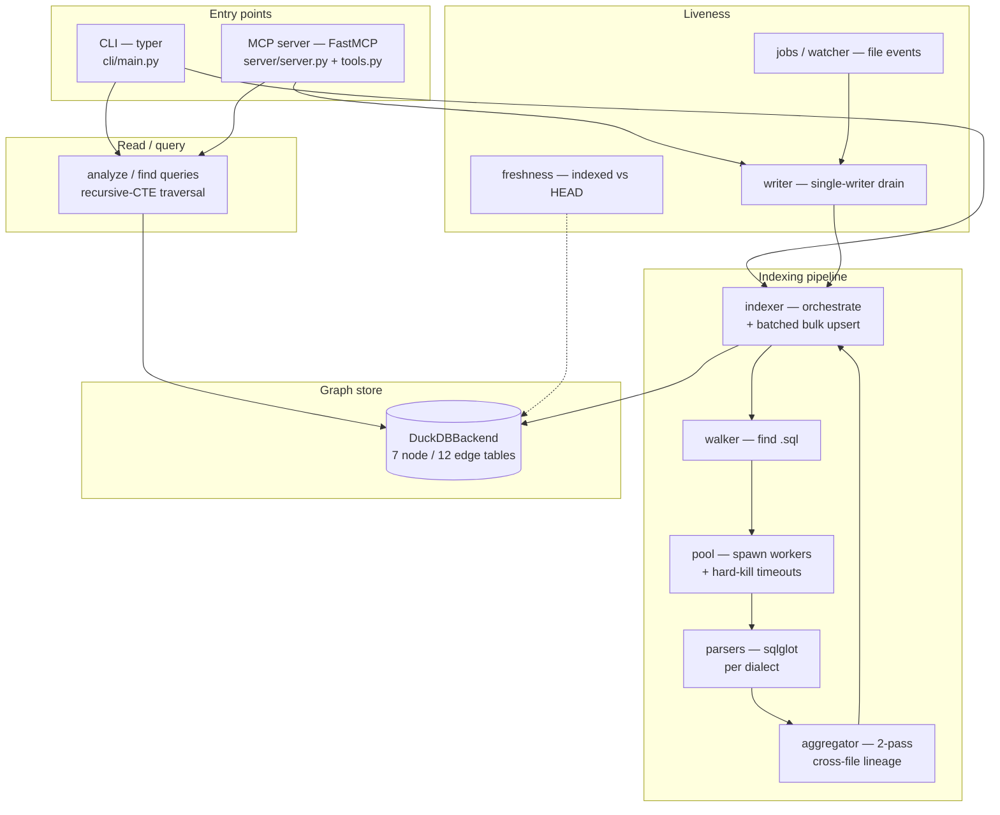

# Architecture Review — sql-code-graph (`sqlcg`)

**Current as of:** v1.5.1 · DuckDB backend · Python 3.12
**Status:** living document — describes the system as it stands today.
**History:** the pre-1.4 blueprint review, PR/issue reviews, and every sprint
postmortem (§1–20 + the Kuzu→DuckDB migration review) are preserved verbatim in
[`ARCHITECTURE_REVIEW_ARCHIVE.md`](ARCHITECTURE_REVIEW_ARCHIVE.md). This file was
overhauled on 2026-06-08 to drop content made stale by the DuckDB migration and the
v1.x releases. See [§7 History](#7-history) for the timeline.

> **Link convention.** Links here use real repo paths (e.g.
> [`base.py`](src/sqlcg/parsers/base.py)) so a rename breaks the link *visibly*. The
> guard test [`test_doc_links.py`](tests/unit/test_doc_links.py) fails CI if any link
> in a maintained doc points at a missing file.

---

## 1. What `sqlcg` is

`sqlcg` indexes a corpus of `.sql` files into an embedded **DuckDB** graph and answers
**lineage** questions over it — "what feeds this column?", "what breaks if I change this
table?", "which views are downstream?". It parses SQL with `sqlglot`, persists tables /
columns / queries / lineage edges as graph nodes and relationships, and exposes the graph
two ways: a `typer` **CLI** (`sqlcg …`) and an **MCP server** for use from Claude.

It targets both ends of a scale spectrum — a ~20-file ETL repo and a 1,000–1,600 file
data warehouse — from the same zero-config `sqlcg index ./sql` entry point. The scale
rules and performance budget live in [`CLAUDE.md`](CLAUDE.md); the invariants that enforce
them are summarised in [§4](#4-performance-invariants).

---

## 2. Component map

**Read path** (`analyze`, `find`, most MCP tools) and **write path** (`index`, `reindex`)
both go through `DuckDBBackend`. When the MCP server is running, the CLI routes reads to it
([`read_client.py`](src/sqlcg/server/read_client.py)) and serialises all writes through a
single-writer drain ([`writer.py`](src/sqlcg/server/writer.py)) so there is exactly one
writer per database.

### 2.1 Responsibilities

| Module | Job |
|---|---|
| [`cli/main.py`](src/sqlcg/cli/main.py) + [`cli/commands/`](src/sqlcg/cli/commands) | Typer CLI. Commands: `index`, `reindex`, `watch`, `report`, `gain`, `install`, `uninstall`; groups `db` (`init`/`reset`/`info`/`list-repos`), `find` (`table`/`column`/`pattern`), `analyze` (`upstream`/`downstream`/`impact`/`failures`/`unused`), `mcp`, `git` (`install-hooks`). |
| [`server/server.py`](src/sqlcg/server/server.py) | FastMCP instance + stdio entry. Constructs `mcp` at module scope (after the stdout→stderr guard) so [`tools.py`](src/sqlcg/server/tools.py) can register tools onto it. |
| [`server/tools.py`](src/sqlcg/server/tools.py) | The 16 MCP tools — `trace_column_lineage`, `get_upstream_dependencies`, `get_downstream_dependencies`, `diff_impact`, `find_table_usages`, `find_definition`, `search_sql_pattern`, `analyze_unused`, `get_hub_ranking`, `index_repo`, `execute_sql`, etc. |
| [`server/writer.py`](src/sqlcg/server/writer.py) | Single-writer queue + drain task. The drain holds `backend_lock` and runs the indexer op directly — the sole backend writer. |
| [`server/read_client.py`](src/sqlcg/server/read_client.py) | Routes CLI read commands through the live server socket when one is running. |
| [`server/control.py`](src/sqlcg/server/control.py) | `.pid` / `.sock` control files for server discovery, status, and stop — keyed off the db path. |
| [`server/models.py`](src/sqlcg/server/models.py) · [`server/exceptions.py`](src/sqlcg/server/exceptions.py) | Pydantic return types for tools; the tool error hierarchy. |
| [`server/noise_filter.py`](src/sqlcg/server/noise_filter.py) | Filters backup tables and schema-alias mirrors out of user-facing surfaces. |
| [`server/skill.py`](src/sqlcg/server/skill.py) | Pure renderer for the bundled Claude skill (`SKILL.md`); the installer writes its output to disk. |
| [`indexer/indexer.py`](src/sqlcg/indexer/indexer.py) | Orchestrates parse → persist. Two-pass index, batched bulk upsert (`_flush_row_batch`), atomic SHA stamping. |
| [`indexer/walker.py`](src/sqlcg/indexer/walker.py) | Walks the corpus for `.sql` files honouring ignore patterns. |
| [`indexer/pool.py`](src/sqlcg/indexer/pool.py) | Spawn-mode worker pool; each worker holds pass-1/pass-2 parsers. Per-task hard-kill timeout + respawn (what `concurrent.futures` can't do). |
| [`indexer/dbt_adapter.py`](src/sqlcg/indexer/dbt_adapter.py) | Enriches `SchemaResolver` from a dbt `manifest.json`. |
| [`indexer/git_delta.py`](src/sqlcg/indexer/git_delta.py) | Computes the changed-file set between two git SHAs for incremental reindex. |
| [`indexer/watcher.py`](src/sqlcg/indexer/watcher.py) | `watchdog` file-event source for `sqlcg watch`. |
| [`indexer/error_classify.py`](src/sqlcg/indexer/error_classify.py) | Maps lineage-extraction failures to the `E{n}` taxonomy for measurement/reporting. |
| [`lineage/aggregator.py`](src/sqlcg/lineage/aggregator.py) | `CrossFileAggregator` — pass-1 source harvest, pass-2 cross-file lineage resolution. |
| [`lineage/schema_resolver.py`](src/sqlcg/lineage/schema_resolver.py) | `SchemaResolver` — table/view/column resolution with a lock-guarded cache. One instance per re-index job (never shared across threads). |
| [`parsers/base.py`](src/sqlcg/parsers/base.py) | Base data models + abstract parser; column-lineage extraction via `sg_lineage`. **Hot path — see [§4](#4-performance-invariants).** |
| [`parsers/registry.py`](src/sqlcg/parsers/registry.py) | Dialect → parser factory. |
| [`parsers/{ansi,snowflake,bigquery,postgres,tsql}_parser.py`](src/sqlcg/parsers) | Per-dialect parsers; Snowflake carries the scripting-block / gap handlers. |
| [`core/duckdb_backend.py`](src/sqlcg/core/duckdb_backend.py) | `DuckDBBackend` — the graph store. 7 node + 12 edge tables, bulk upsert via `unnest`, reentrant `transaction()`, `run_read`, recursive-CTE traversal SQL. |
| [`core/graph_db.py`](src/sqlcg/core/graph_db.py) | `GraphBackend` ABC. Single-impl today (see [§5](#5-active-findings)); kept for the v2 second-source path. |
| [`core/schema.py`](src/sqlcg/core/schema.py) | Node/edge labels + `SCHEMA_VERSION` (the schema gate). |
| [`core/queries.py`](src/sqlcg/core/queries.py) | Loader for query strings in `queries.sql`. |
| [`core/config.py`](src/sqlcg/core/config.py) | `DbConfig.from_env()` — resolves the db path and settings. |
| [`core/freshness.py`](src/sqlcg/core/freshness.py) | Backend-free indexed-SHA-vs-HEAD delta; unit-testable with only a git repo. |
| [`core/jobs.py`](src/sqlcg/core/jobs.py) | Watch job manager — debounced reindex on file-change events. |
| [`metrics/store.py`](src/sqlcg/metrics/store.py) | SQLite metrics store; opt-out via `SQLCG_METRICS=0`. |

---

## 3. Key flows

### 3.1 Indexing (`sqlcg index`)
[`walker`](src/sqlcg/indexer/walker.py) enumerates `.sql` files →
[`pool`](src/sqlcg/indexer/pool.py) farms them to spawn workers → each
[`parser`](src/sqlcg/parsers/base.py) produces tables/columns/queries and per-statement
column lineage. The [`aggregator`](src/sqlcg/lineage/aggregator.py) runs **two passes**:
pass-1 harvests CTE/CTAS bodies and DDL into the `SchemaResolver`; pass-2 reparses with a
`dependency_filter` to resolve cross-file lineage. [`indexer`](src/sqlcg/indexer/indexer.py)
accumulates rows across a batch and issues **one bulk upsert per node/edge label per batch**
into [`DuckDBBackend`](src/sqlcg/core/duckdb_backend.py), stamping the indexed SHA inside the
same transaction.

### 3.2 Query / lineage (`sqlcg analyze`, MCP tools)
Lineage traversal is a recursive CTE in DuckDB with a depth cap + path-based cycle guard.
A kind-filter (`WHERE kind IS NULL OR kind IN ('table','external')`) keeps CTE/derived
scratch nodes out of user-facing surfaces. Up/down direction differ only in which
`COLUMN_LINEAGE` edge endpoint binds the result's `file:line`.

> **Mental model — CTE/derived edges are structural, not coverage gaps.** For
> `INSERT INTO t (cols) WITH cte … SELECT … FROM cte`, the parser emits two *different,
> both-correct* edge families: (1) **CTE chain edges** where the CTE node is the `dst`
> (`src.x → cte.col`, from the CTE-projection block) and (2) **positional edges** where the
> CTE is the `src` and the real target is the `dst` (`cte.col → t.col`, from the `#25`
> block). Multi-hop **upstream** traversal walks *both* to chain `t.col ← cte.col ← src.x`.
> A `kind='cte'`/`kind='derived'` node is a scratch intermediate, never persistent schema,
> so it can **never** carry a `HAS_COLUMN` row — but it is *required* in the edge set for
> traversal. Suppressing family (1) (an earlier "P1 de-leak" attempt) dead-ends upstream
> traversal at the CTE node and was reverted; the canary is
> [`test_analyze_case_fold`](tests/integration/test_analyze_case_fold.py)
> (`test_uppercase_upstream_anchor_returns_same_ids_as_lowercase`).

> **Coverage-metric formula — edge health is scoped to real-table destinations.** The
> `edge_health` and `blindspot` metrics in [`coverage.py`](src/sqlcg/cli/coverage.py)
> count a `COLUMN_LINEAGE` edge as "good" only when its stripped dst table has a
> `HAS_COLUMN` entry. Because CTE/derived dst edges can never be catalogued (above), they
> are **excluded from both numerator and denominator** via
> `WHERE EXISTS (SELECT 1 FROM "SqlTable" t WHERE t.qualified = <dst_table strip> AND
> t.kind NOT IN ('cte','derived'))`. This mirrors the analyze-surface kind-filter: scratch
> nodes are scored out of coverage exactly as they are filtered out of user surfaces.
> Counting them (the pre-2026-06 formula) made ≥95 % edge health mathematically impossible
> — ~29 % of all edges legitimately point at CTE/derived intermediates.

### 3.3 MCP server + single-writer model
[`server.py`](src/sqlcg/server/server.py) runs FastMCP over stdio. Writes (`index`,
`reindex`) are enqueued and drained by [`writer.py`](src/sqlcg/server/writer.py) under
`backend_lock` — one writer per db. The full-rebuild drain wraps `clear_all_tables()` +
`index_repo()` in one reentrant transaction, so a mid-rebuild failure rolls back to the
prior graph. Reads currently share that lock (see [§5](#5-active-findings)).

### 3.4 Freshness / reindex / watch
[`freshness`](src/sqlcg/core/freshness.py) compares the stored `indexed_sha` to git HEAD;
[`git_delta`](src/sqlcg/indexer/git_delta.py) yields the changed files; `reindex` /
[`jobs`](src/sqlcg/core/jobs.py) + [`watcher`](src/sqlcg/indexer/watcher.py) drive
incremental updates (`git install-hooks` wires this to commits).

---

## 4. Performance invariants

These are **not duplicated here** — the canonical table (parser hot-path rules, bulk-upsert
and batch-flush invariants, the named regressions each guards) lives in
[`CLAUDE.md`](CLAUDE.md) under *Performance invariants — DO NOT REMOVE OR SIMPLIFY*. They
are pinned by [`test_perf_scaling_guard.py`](tests/unit/test_perf_scaling_guard.py),
[`test_bulk_upsert_invariant.py`](tests/unit/test_bulk_upsert_invariant.py),
[`test_upsert_batch_invariant.py`](tests/unit/test_upsert_batch_invariant.py), and
[`test_T09_01_qualify_once.py`](tests/unit/test_T09_01_qualify_once.py). Any refactor of
[`base.py`](src/sqlcg/parsers/base.py) or [`indexer.py`](src/sqlcg/indexer/indexer.py) must
keep them green.

---

## 5. Active findings

Only genuinely-open items live here. Resolved findings and their reasoning are in the
[archive](ARCHITECTURE_REVIEW_ARCHIVE.md).

| # | Sev | Finding | Where | Plan |
|---|-----|---------|-------|------|
| F1 | LOW | **Scratch-object leak into the default `analyze` surface.** ~22% of `kind='table'` nodes carry `tmp_*`/`temp_*` prefixes and leak into filtered output. Fix belongs at **classification time** (emit `kind='derived'` for TEMP/TRANSIENT CTAS targets), never in the name-blind filter. | [`aggregator.py`](src/sqlcg/lineage/aggregator.py) `_build_file_rows`, [`analyze.py`](src/sqlcg/cli/commands/analyze.py) | none yet |
| F2 | LOW | **Non-blocking reads not realised.** `run_read` uses the single shared `self._conn`, and the server serialises reads behind `backend_lock`, so a read mid-rebuild waits for the full ~2.5 min rebuild instead of seeing the old MVCC snapshot. Fix: serve reads from `self._conn.cursor()` and drop the read side of the lock. | [`duckdb_backend.py`](src/sqlcg/core/duckdb_backend.py) `run_read`, [`writer.py`](src/sqlcg/server/writer.py) | [migration plan](plan/sprints/feature_kuzu_to_duckdb_migration.md) |
| F3 | LOW | **1,600-file write-memory ceiling unverified.** The full rebuild is one transaction (per-batch commits subsumed), so peak WAL/undo is the whole graph. Proven fine at ~1,391 files; measure headroom at the 1,600 target before closing the perf budget. | [`indexer.py`](src/sqlcg/indexer/indexer.py), [`duckdb_backend.py`](src/sqlcg/core/duckdb_backend.py) | none yet |
| F4 | LOW | **Single-impl ABC + stale Cypher/Kuzu docstrings.** `GraphBackend` adds indirection without polymorphism now; `clear_all_tables` is a `NotImplementedError`-default on the ABC; a docstring still says "skipped by KuzuDB's MERGE semantics". De-Cypher the docstrings and relocate `clear_all_tables` off the ABC, or collapse the ABC if v2 ACCESS_HISTORY is shelved. | [`graph_db.py`](src/sqlcg/core/graph_db.py) | none yet |
| F5 | LOW | **TC6b guard reconstructs the query.** The terminal-sink test rebuilds the downstream Cypher/SQL string instead of running `analyze downstream` end-to-end, so it can drift from the shipped query. Replace with a `CliRunner`-based guard. | [`test_user_surface_recall_guard.py`](tests/integration/test_user_surface_recall_guard.py) | none yet |
| F6 | LOW | **Dead `_set_backend_lock` stub.** Defined but never called (the escalation plumbing it belonged to was deleted in the DuckDB migration). Violates the CLAUDE.md "every new method has a grep-confirmed call site" rule — remove it. | [`tools.py`](src/sqlcg/server/tools.py) | none yet |
| F7 | MED | **95 % edge-health milestone is ~30 points short after P1/P3/P4.** With the scoped metric (CTE/derived excluded) the DWH baseline is ≈41 %; P3 (+6,045 edges) + P4 lift it to ≈55–65 %. Reaching ≥95 % needs catalogs for ~566 residual **real-table** blindspots — the P2 cohort (temp / cross-file / unseen-DDL tables) and the deferred P5 `USE SCHEMA` bare-name group (956 tables). The 95 % milestone must be re-baselined or scoped to a follow-up sprint (BQ-2). | [`coverage.py`](src/sqlcg/cli/coverage.py), [`base.py`](src/sqlcg/parsers/base.py) | [coverage_p1_p3_p4](plan/sprints/coverage_p1_p3_p4.md) §95 % Feasibility Analysis |

---

## 6. Deferred / roadmap

- **v2 — Snowflake `ACCESS_HISTORY` as a second lineage source.** Fuse query-history lineage
  to *enrich* (not replace) static parsing. This is the main reason the `GraphBackend` ABC
  (F4) is kept rather than collapsed.
- **ETL session-context limits (fundamental).** Cross-session temp tables, `COPY INTO`
  column mapping, and dynamic `IDENTIFIER()` references are static-analysis limits — they
  need runtime information. Intra-file temp-table chains resolve via pass-1 DDL sniffing;
  cross-file/cross-session chains do not. Full analysis in the
  [archive §6](ARCHITECTURE_REVIEW_ARCHIVE.md).
- **Incremental reindex** (vs. full rebuild) — the real fix for F2/F3's lock-duration and
  memory pressure; explicitly deferred during the DuckDB migration.

---

## 7. History

Earlier content is preserved verbatim in
[`ARCHITECTURE_REVIEW_ARCHIVE.md`](ARCHITECTURE_REVIEW_ARCHIVE.md). Detailed per-release
plans live in [`plan/`](plan) (a frozen historical archive — see
[`plan/WORKFLOW.md`](plan/WORKFLOW.md) for the agent pipeline that produced them).

| Era | What it covered |
|---|---|
| Pre-1.4 blueprint review (archive §1–7) | Original design review, ETL-lineage gap analysis, open questions. |
| PR/issue reviews (archive §8, §10) | PR #1 inline comments; issues #5/#6 LLM-experience feedback. |
| v0.3–v1.3 sprint postmortems (archive §11–20) | Column-lineage diagnostics, the `E{n}` taxonomy, bulk-upsert/perf work, freshness + single-writer queue, recall guards. |
| Kuzu → DuckDB migration (archive, v1.4.0) | Backend swap, perf-invariant re-verification, the concurrency-model deviation that became F2. |
